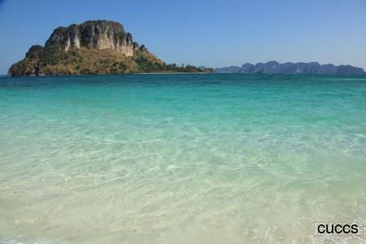
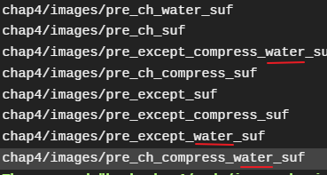
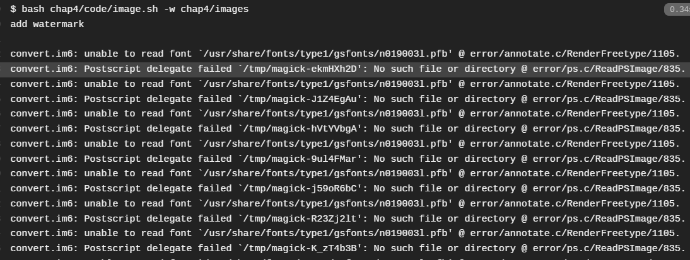
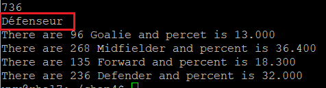

## 未完成任务
- 任务一中对图片进行添加水印操作，在本地能正确执行

在`travis-ci`上从后面的结果看应该是执行成功了，但是有一堆好像与我代码没什么关系的错误

## 问题
- 任务二中读取运动员位置读取出一个奇怪的词，在本地文件中查看，是没有这个词的

## 参考
[2015-linux-public-RachelLYY/tree/labs/lab4](https://github.com/CUCCS/2015-linux-public-RachelLYY/tree/labs/lab4/)
[2015-linux-public-yangyisama/tree/master/Exp4](https://github.com/CUCCS/2015-linux-public-yangyisama/tree/master/Exp4)