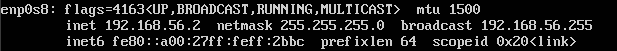
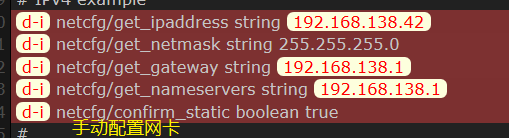

## 实验目的：配置无人值守安装iso并在Virtualbox中完成自动化安装

## 实验步骤
1. 为安装好ubuntu18.04的系统配置（用户名：ywy）双网卡，其中一块为Host_Only，IP : 192.168.56.2。在虚拟机上安装ssh

    

2. 通过chocolatey安装openssh,生成密钥对

        choco install openssh
        ssh-keygen -t rsa

    - 注意公私钥的保存位置，以免覆盖已存在的密钥对
    
    

3. 在虚拟机中创建一个`~/.ssh`目录，在该目录下建立名为`authorized_keys`的文件，通过sftp将公钥文件导入到认证文件
- 连接虚拟机 

        sftp ywy@192.168.56.2 (需要输入虚拟机登录密码)
- 上传公钥

        put 本地公钥文件地址 ~/.ssh/authorized_keys

4. 在虚拟机开启自动认证功能

        vim /etc/ssh/sshd_config
    

    

5. 通过sftp上传`ubuntu-16.04.1-server-amd64.iso`

        put ubuntu-16.04.1-server-amd64.iso本地位置

- 此时sftp连接虚拟机不再需要虚拟机登录密码

    

    
    
    (在生成密钥对时输入了密码)

6. 生成安装镜像

- 在当前用户目录下创建一个用于挂载iso镜像文件的目录

        mkdir loopdir

- 挂载iso镜像文件到该目录

         mount -o loop ubuntu-16.04.1-server-amd64.iso loopdir

- 创建一个工作目录用于克隆光盘内容

        mkdir cd
 
- 同步光盘内容到目标工作目录
- 一定要注意loopdir后的这个/，cd后面不能有/

        rsync -av loopdir/ cd

- 卸载iso镜像

        umount loopdir

- 进入目标工作目录

        cd cd/

- 编辑Ubuntu安装引导界面增加一个新菜单项入口

        vim isolinux/txt.cfg

    - 在顶部加上如下内容

            label autoinstall
            menu label ^Auto Install Ubuntu Server
            kernel /install/vmlinuz
            append  file=/cdrom/preseed/ubuntu-server-autoinstall.seed debian-installer/locale=en_US console-setup/layoutcode=us keyboard-configuration/layoutcode=us console-setup/ask_detect=false localechooser/translation/warn-light=true localechooser/translation/warn-severe=true initrd=/install/initrd.gz root=/dev/ram rw quiet
- 将事先准备好的`ubuntu-server-autoinstall.seed`通过`sftp`上传到虚拟机，并放置于指定路径下`/cd/preseed/`

    

- 修改`isolinux/isolinux.cfg`，增加内容timeout 10

-  重新生成md5sum.txt
        cd ~/cd && find . -type f -print0 | xargs -0 md5sum > md5sum.txt

    - 在重新计算md5sum.txt.时，出现了`Permission Denied`错误，通过修改文件`md5sum.txt`的权限解决这一问题

            sudo chmod 777 md5sum.txt

- 生成镜像 

        sudo bash shell

        # shell内容
        IMAGE=custom.iso
        BUILD=~/cd/

        mkisofs -r -V "Custom Ubuntu Install CD" \
                    -cache-inodes \
                    -J -l -b isolinux/isolinux.bin \
                    -c isolinux/boot.cat -no-emul-boot \
                    -boot-load-size 4 -boot-info-table \
                    -o $IMAGE $BUILD
    
    

    
    
7. 通过`sftp`导出`custom.iso`

        get /home/ywy/cd/custom.iso 本地地址

8. 利用`custom.iso`进行无值守安装

    
    

  
    
## preseed.cfg差异

1. 

2. 

3. 

    
4. 

5. 

6. 

7. 

8. 

9. 

10. 

11. 

## 参考
[PowerShell使用ssh配置连接服务器](https://blog.csdn.net/tuzixini/article/details/82013230)

[chocolatey安装](https://chocolatey.org/)

[github.com/CUCCS/linux-2019-jackcily/blob/job1](https://github.com/CUCCS/linux-2019-jackcily/blob/job1/%E5%AE%9E%E9%AA%8C%E4%B8%80.md)