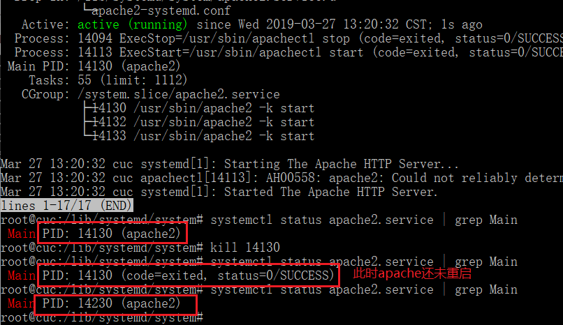

# 命令篇

## Systemd

## Unit

## Target and Log

## 如何添加一个用户并使其具备sudo执行程序的权限？

- 在具备`sudo`执行程序权限的用户下添加新用户`tmpusr`

    - `sudo adduser tmpusr`

        

        

- 将新用户添加到`sudo`组

    - 需加上`-a`，不然会离开已在组

        

## 如何将一个用户添加到一个用户组？

- `usermod -aG groupname username`

## 如何查看当前系统的分区表和文件系统详细信息？

- 分区表：`sudo fdisk -l`
- 文件系统详细信息：`df -a`

## 如何实现开机自动挂载Virtualbox的共享目录分区？（失败）

- 共享文件夹名称 `shareubuntu`

- 虚拟机中创建共享目录 `mkdir /mnt/share`

- 挂载 `mount-t vboxsf shareubuntu /mnt/share`

- 编辑`/etc/fstab`，加上
    `shareubuntu /mnt/share vboxsf default 0 0`

## 基于LVM（逻辑分卷管理）的分区如何实现动态扩容和缩减容量？

- 减容
    - `sudo lvreduce --size -1G /dev/cuc-vg/root`

    - 减容前

        

    - 减容后

        

- 扩容

    - `sudo lvextend --size +1G /dev/cuc-vg/root`

## 如何通过systemd设置实现在网络连通时运行一个指定脚本，在网络断开时运行另一个脚本？

- 在网络连接的配置文件中，做如下修改

    - `ExecStart=script1`

    - `ExecStop=script2`

## 如何通过systemd设置实现一个脚本在任何情况下被杀死之后会立即重新启动？实现杀不死.

- 将配置文件的`Restart`设置为`always`

    - 服务在停止后会立马重启

    

    - 设置`RestartSec=10`

    

## 什么是effective user ID
- `effective user ID`根据其来决定你具有哪些操作权限，可以暂时的切换到其他用户（如:root），实现某些操作

## 什么是effective group ID
- 同 `effective user id`

# 参考
[自动挂载共享文件夹](https://www.jianshu.com/p/21df1811133f)

[命令篇](http://www.ruanyifeng.com/blog/2016/03/systemd-tutorial-commands.html)

[实战篇](http://www.ruanyifeng.com/blog/2016/03/systemd-tutorial-part-two.html)

[linux-2019-tclhh/blame/exp3/exp3/](https://github.com/CUCCS/linux-2019-tclhh/blame/exp3/exp3/LINUX%E6%9C%8D%E5%8A%A1%E5%99%A8%E7%B3%BB%E7%BB%9F%E7%AE%A1%E7%90%86%E5%9F%BA%E7%A1%80.md)