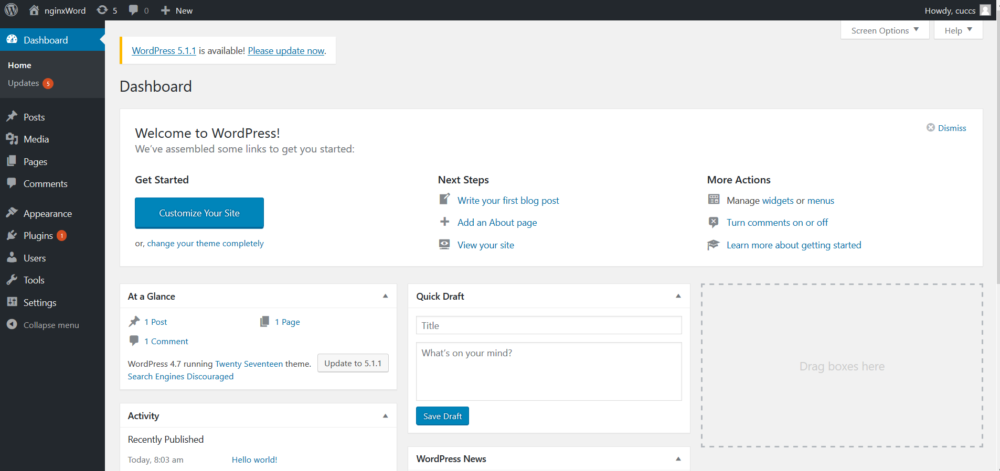

## 实验环境

### ubuntu18.04
- `IP : 192.168.56.2`

- `VeryNginx : 8080  443`
- `wordpress(nginx) : 80`
- `dvwa(nginx) : 8888`

### win10

- `IP : 192.168.56.1`

### ubuntu16.04

- `IP : 192.168.56.3`

## 整体结构


## VeryNginx

### 依赖

#### 有些依赖包可能无法找到，可以`apt search`一下
- `pcre3`
- `pcre-dev`
- `lua-rex-libssl`
- `build-essential`
- `zlib1g`
- `libssl1.0-dev`(装`libssl-dev`没用)
- `libssl`

#### 端口监听

```bash

    server {
        listen       8080;

        #this line shoud be include in every server block
        include /opt/verynginx/verynginx/nginx_conf/in_server_block.conf;

        location = / {
            root   html;
            index  index.html index.htm;
        }
    }
    server {
        listen       443 ssl;

        #this line shoud be include in every server block
        include /opt/verynginx/verynginx/nginx_conf/in_server_block.conf;

        location = / {
            root   html;
            index  index.html index.htm;
        }
        #include /etc/nginx/snippets/snakeoil.conf;
        # 配置ssl
        ssl on;
        ssl_certificate /etc/ssl/certs/nginx-selfsigned.crt;
        ssl_certificate_key /etc/ssl/private/nginx-selfsigned.key;


    }


```


## LEMP stack

### nginx安装
- `sudo apt install nginx`

### MySQL安装
- `sudo apt install mysql-server`
- `sudo mysql_secure_installation`

### PHP安装
- `sudo add-apt-repository universe`
- `sudo apt install php-fpm php-mysql`


## wordpress

### 为`wordpress`创建`MySQL`数据库和用户
```bash
 CREATE DATABASE wordpress DEFAULT CHARACTER SET utf8 COLLATE utf8_unicode_ci;

# password已修改
 GRANT ALL ON wordpress.* TO 'wordpressuser'@'localhost' IDENTIFIED BY 'password';

 FLUSH PRIVILEGES;

```

### 安装PHP扩展

```

sudo apt update
sudo apt install php-curl php-gd php-intl php-mbstring php-soap php-xml php-xmlrpc php-zip

```


### 配置nginx
添加并配置一个服务块
- `/var/www/` 下增加 `wp.cn/html` 为 `wp.sec.cuc.edu.cn` 提供网页内容，并将 `wordpress` 复制到该目录下

```
    cp share/wordpress /var/www/wp.cn/html

```

- 在 `/etc/nginx/sites-available` 下添加服务块 `wp.cn`

```bash
    sudo vim /etc/nginx/sites-available/wp.cn
    
    # 处理http请求
    server {
        listen 80;
        server_name  wp.sec.cuc.edu.cn;

         root /var/www/wp.cn/html;
        index index.html index.htm index.php index.nginx-debian.html;

         location / {
                try_files $uri $uri/ =404;
        }


         #配置php-fpm
        location ~ \.php$ {
                include snippets/fastcgi-php.conf;
                fastcgi_pass unix:/var/run/php/php7.2-fpm.sock;
        }

      }

   
```

- 链接到 `/etc/nginx/sites-enabled`

```
sudo ln -s /etc/nginx/sites-available/wp.cn /etc/nginx/sites-enabled/

```
- 安装 `wordpress`

    - `http://wp.sec.cuc.edu.cn/readme.html` 访问按照引导进行安装

    - 安装完成

        

## DVWA

```bash
#下载`DVWA`

    git clone https://github.com/ethicalhack3r/DVWA

#移动 DVWA 到 /var/www/html

#修改 /DVWA/config/config.inc.php.dist
    
    sudo mv config.inc.php.dist config.inc.php

# 配置`config.inc.php`，密码换成自己的

    $_DVWA[ 'db_server' ]   = '127.0.0.1';
    $_DVWA[ 'db_database' ] = 'dvwa';
    $_DVWA[ 'db_user' ]     = 'dvwauser';
    $_DVWA[ 'db_password' ] = 'p@word';

    # 生成并填写
    $_DVWA[ 'recaptcha_public_key' ]  = '';

    $_DVWA[ 'recaptcha_private_key' ] = '';


# 为DVWA创建数据库和用户

    CREATE DATABASE dvwa DEFAULT CHARACTER SET utf8 COLLATE utf8_unicode_ci;

    GRANT ALL ON dvwa.* TO 'dvwauser'@'localhost' IDENTIFIED BY 'password';

# 为dvwa配置服务块

    server {
        listen 8888;
        server_name  dvwa.sec.cuc.edu.cn;

         root /var/www/html/DVWA;
        index index.html index.htm index.php index.nginx-debian.html;

         location / {
                try_files $uri $uri/ =404;
        }


         #配置php-fpm
        location ~ \.php$ {
                include snippets/fastcgi-php.conf;
                fastcgi_pass unix:/var/run/php/php7.2-fpm.sock;
        }

      }

# 重启MySQL和nginx

    sudo systemctl restart mysql

    sudo systemctl restart nginx

```
- 登录

    


## 反向代理
- 配置

    

    

    

- 结果

    

    

    

## 加固

- IP地址方式均无法访问上述任意站点

    

    

    

    

- DVWA只允许白名单上的访客来源IP


    
    - 物理主机(192.168.56.1)正常访问

        

    - 另一虚拟机(192.168.56.3)被拒绝

        

        


- `VeryNginx`的Web管理页面仅允许白名单上的访客来源IP


    

- 热修复WordPress < 4.7.1 - Username Enumeration

    - 没用复现漏洞，只能`强行修复`
        
        


        

        

        

        

  


- 通过配置VeryNginx的Filter规则实现对Damn Vulnerable Web Application (DVWA)的SQL注入实验在低安全等级条件下进行防护（过滤一些敏感字符）

    

    

    

    


- 通过定制VeryNginx的访问控制策略规则实现：
    - 限制DVWA站点的单IP访问速率为每秒请求数 < 50，限制Wordpress站点的单IP访问速率为每秒请求数 < 20，超过访问频率限制的请求直接返回自定义错误提示信息页面-4

        

        


    - 禁止curl访问

        

        

        

        

        


## 问题

- 安装`VeryNginx`时，文档中给的安装依赖太不靠谱了，安装后，启动`verynginx`会报各种错，而且错误信息没什么参考价值

- 在限制访问频率时，尝试用hping3对站点进行泛洪，同时通过浏览器访问站点，但还是能访问成功

- 开始以为`wordpress(nginx)`要监听两个端口，通过`http`方式`8880`端口进行安装配置的，但在进行安装配置时会在它的数据库的`wp-options`中写入相应的端口和`url`信息，这样会导致`https`访问时会自动跳转到`8880`端口，后来了解到通过`http`、`https`访问是通过`verynginx`反向代理实现的，所以让`wordpress(nginx)`监听在`80`端口
    
    

    


## 参考
[how-to-install-wordpress-with-lemp-on-ubuntu-18-04](https://www.digitalocean.com/community/tutorials/how-to-install-wordpress-with-lemp-on-ubuntu-18-04#prerequisites)

[how-to-install-linux-nginx-mysql-php-lemp-stack-ubuntu-18-04](https://www.digitalocean.com/community/tutorials/how-to-install-linux-nginx-mysql-php-lemp-stack-ubuntu-18-04)

[how-to-create-a-self-signed-ssl-certificate-for-nginx-in-ubuntu-18-04](https://www.digitalocean.com/community/tutorials/how-to-create-a-self-signed-ssl-certificate-for-nginx-in-ubuntu-18-04#step-4-%E2%80%93-enabling-the-changes-in-nginx)

[ubuntu搭建DVWA](https://blog.csdn.net/u010953692/article/details/88761006)

[linux-2019-jckling/blob/0x05/0x05/](https://github.com/CUCCS/linux-2019-jckling/blob/0x05/0x05/%E5%AE%9E%E9%AA%8C%E6%8A%A5%E5%91%8A.md)

[CUCCS/linux/tree/master/2017-1/snRNA](https://github.com/CUCCS/linux/tree/master/2017-1/snRNA)

